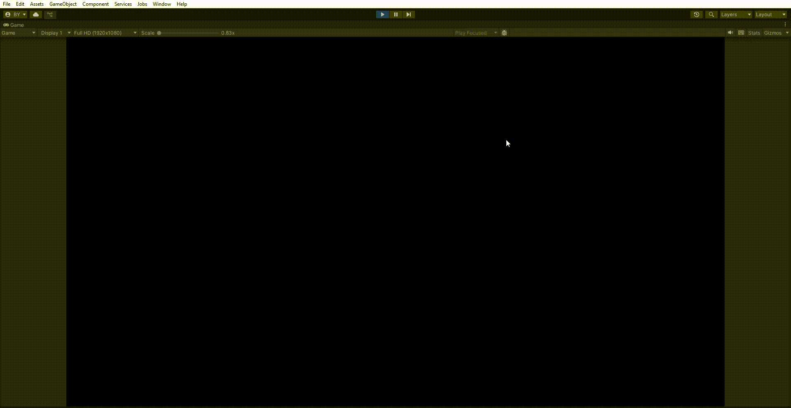
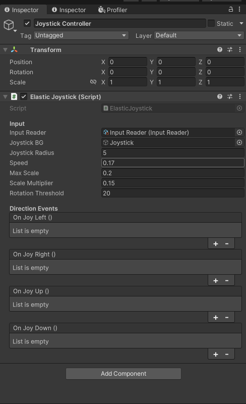

# 🎮 ElasticJoystick - Unity UI Joystick with Bounce & Direction Events

A slick, responsive joystick made for Unity UI that **stretches, rotates**, and fires directional events like a boss. Plug it in, drag your thumb, and go full mobile game mode.

## 🧰 Features

- ✅ Responsive elastic motion with scale/rotation
- ✅ Easily pluggable into any UI canvas
- ✅ Supports mouse & touch input out of the box
- ✅ Built-in **UnityEvents** for:
  - 🔼 Drag Up
  - 🔽 Drag Down
  - ⬅️ Drag Left
  - ➡️ Drag Right
- ✅ Minimal setup, max results

---

## 🖼️ Inspector Preview

> You'll see this in the Unity Inspector to quickly wire up drag directions to your own systems.

---

## 🚀 How to Use

### 1. 📦 Add to Your Scene
- Drag the **Joystick** and **Joystick Controller** prefabs to your canvas(for better results UI Scale Mode should be **Scale With Screen Size**)
- Assign your **InputReader** if you're using a custom input system

### 2. 🖱️ Hook Up Events
- In the Inspector, assign UnityEvents for:
  - `OnJoyLeft`
  - `OnJoyRight`
  - `OnJoyUp`
  - `OnJoyDown`

> Use these to trigger player movement, UI feedback, or whatever fits your game.

---

## 🔧 Parameters

| Field | Description |
|-------|-------------|
| `Speed` | How fast the joystick returns to neutral |
| `Max Scale` | Max amount of scale squash/stretch |
| `Scale Multiplier` | Intensity of scaling |
| `Rotation Threshold` | Minimum drag speed before rotation applies |
| `Joystick Radius` | Auto-set based on UI size but you can override it |

---

## 📜 Dependencies

- Uses Unity's **UI system**
- Uses the new input system (if we still can call it new)
- Compatible with both **mouse and touch** (out of the box)
- Optionally uses a custom `InputReader` if you want to hook it into your own input architecture

---

## 🧠 Author

Made with ✌️ by **[Brahim Ben Youssef](https://github.com/brahimby)**

---

## 📄 License

MIT — free to use, modify, and throw into your next game jam.

